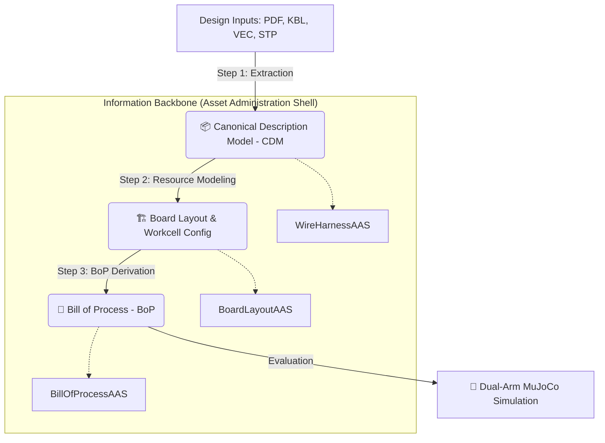

# NEXUS: End-to-End Robotic Wire Harness Assembly

> **Nexus** is an AI-driven framework that bridges the "engineering-to-execution" gap in automated wire harness production. It transforms fragmented design data (KBL, VEC, STP, PDF) into machine-executable robotic instructions using a structured Product-Process-Resource (PPR) pipeline.

---

## 🚀 The Nexus Pipeline

The project implements a three-step automated pipeline as presented in our **ETFA 2026** paper (under review).

### 1. [Ingestion & Semantic Enrichment](./cdm)
Converts heterogeneous design artifacts into a unified **Product (P)** model.
- **AI-Powered**: Uses Vision-Language Models (VLMs) to infer manufacturing intent.
- **Structured**: Outputs the **Canonical Description Model (CDM)**.

### 2. [Resource Modeling](./layout_generator)
Automatically derives the **Resource (R)** dimension for the production cell.
- **Board Generation**: Positions connector holders and cable support pegs.
- **Workcell Mapping**: Configures dual-robot workspaces and exclusion zones.

### 3. [Bill of Process Derivation](./bill_of_process)
Generates the **Process (P)** dimension of the assembly.
- **Inside-Out Strategy**: Optimizes routing order to prevent cable tangling.
- **Robot-Ready**: Fully parameterized, sequenced assembly steps.

---

## 🛠️ Key Technologies

- **[AAS (Asset Administration Shell)](./aas)**: Standardized digital twins for interoperable data exchange across the supply chain.
- **[MuJoCo Simulation](./simulation)**: High-fidelity physics environment for verifying assembly sequences with dual UR10e robots.
- **[Extraction Engine](./extraction)**: AI-driven pipeline for multimodal data fusion and semantic enrichment.
- **[Cable Handling](./cable_handling)**: Low-level control "Skills" for dexterous wire manipulation and force feedback.

---

## 🏗️ Repository Structure

| Folder | Description | PPR Dimension |
| :--- | :--- | :--- |
| [`cdm/`](./cdm) | Canonical Description Model & Schemas | **Product** |
| [`layout_generator/`](./layout_generator) | Board Layout & Resource Optimization | **Resource** |
| [`bill_of_process/`](./bill_of_process) | Assembly Sequencing & Process Planning | **Process** |
| [`aas/`](./aas) | Asset Administration Shell Serialization | **Infrastructure** |
| [`simulation/`](./simulation) | MuJoCo Workcell & Sequence Verification | **Evaluation** |
| [`extraction/`](./extraction) | AI-Driven Multimodal Data Fusion | **Step 1** |
| [`cable_handling/`](./cable_handling) | Low-level Robot Skills & Controllers | **Skill** |

---

## 📖 Citation

We will add information on how to cite this work in the future.