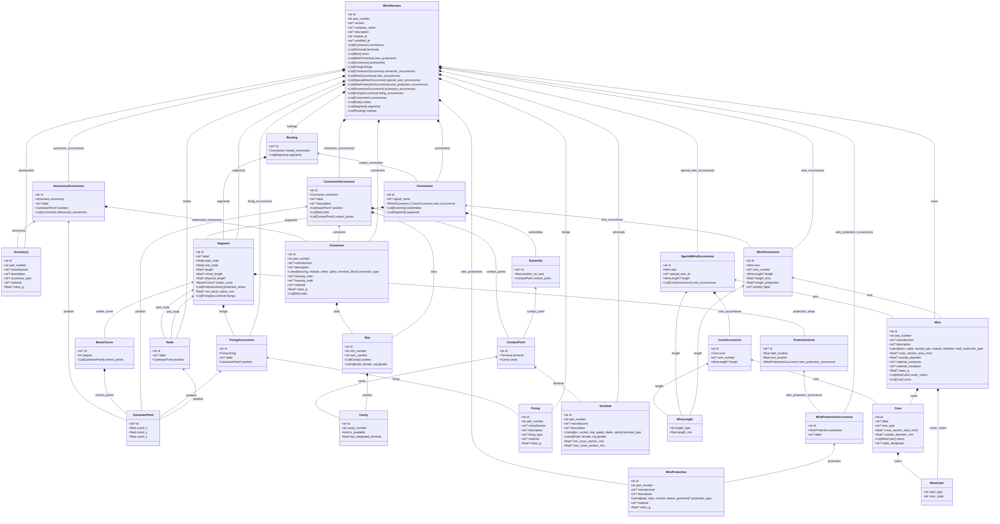

# 📦 Canonical Description Model (CDM)

The **Canonical Description Model (CDM)** serves as the unified data backbone for the end-to-end robotic assembly pipeline. It forms the **Product** dimension and is introduced onwards from **Step 1: Ingestion and Semantic Enrichment** by consolidating fragmented design data (KBL, VEC, STP, and PDF) into a single, machine-readable manufacturing blueprint.

## 🌟 Overview

In the current wire harness industry, design data is often fragmented across multiple heterogeneous formats. The CDM harmonizes these inputs into a structured **Product (P)** dimension of the Product-Process-Resource (PPR) model, enabling downstream automation of resource modeling and process planning.

### Key Features:
- **Unified Schema**: A comprehensive Pydantic-based schema for wire harness components, occurrences, and topology.
- **Multimodal Data Fusion**: Supports the ingestion of geometric data (STP/VEC) and semantic data (KBL/PDF) using AI-driven extraction.
- **Topological Integrity**: Encodes complex relationships between connectors, terminals, wires, and segments.
- **Machine-Ready**: Designed for direct consumption by the [Layout Generator](../layout_generator) and [BoP Derivation](../bill_of_process) modules.

## 🏗️ Model Structure

The CDM is organized into three primary layers:

1.  **Definitions**: Master data for components (Connectors, Terminals, Wires, Fixings).
2.  **Occurrences**: Instances of components within a specific harness variant (ConnectorOccurrences, WireOccurrences).
3.  **Topology**: The physical structure of the harness (Nodes, Segments, ProtectionAreas).

## 📁 Directory Structure

- `definitions/`: Contains the source of truth for the CDM schema in Python (`cdm_schema.py`), JSON Schema (`cdm.schema.json`), and TypeScript (`cdm_schema.ts`).
- `scripts/`: Utilities for generating definitions, visualizing the schema, and creating diagrams.
- `examples/`: Example CDM instances for various harness topologies (Backbone, Tree, Star, Linear).

## 🚀 Usage

The CDM is the starting point for the assembly pipeline. Once a CDM is generated from customer design artifacts, it is serialized as a **WireHarnessAAS** [Asset Administration Shell](../aas), making it available across the entire supply chain.

---
> [!NOTE]
> For more details on how the CDM is extracted from raw design data using Vision-Language Models (VLMs), refer to Section IV-A of the [ETFA 2026 Paper](../ETFA_2026__From_Design_to_Action__Enabling_End_to_End_Robotic_Wire_Harness_Assembly.pdf).
